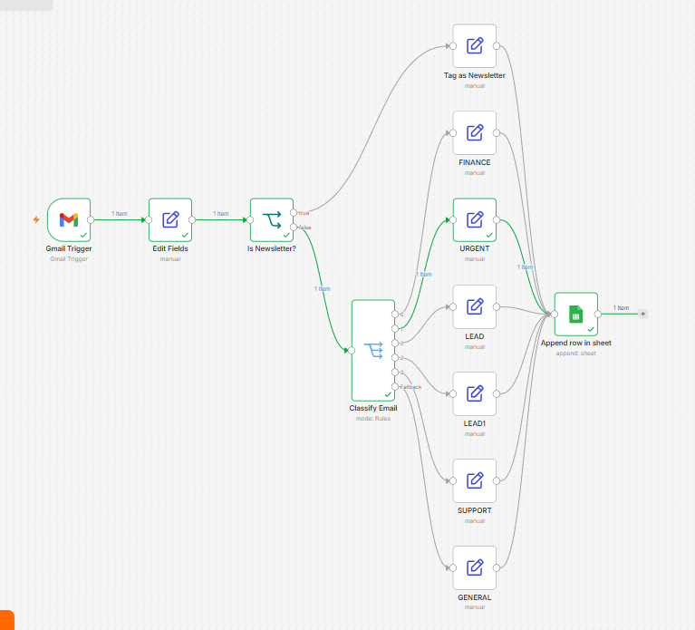
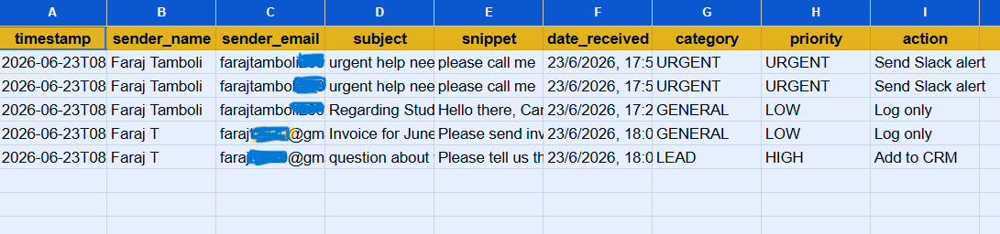

# 📧 Intelligent Email Classification & Logging System

> An n8n automation that reads every incoming email, classifies it by business intent, and logs it to Google Sheets — automatically, 24/7, with zero manual effort.

---

## 🎯 The Problem

Every business owner drowns in email. Leads, invoices, support requests, and newsletters all land in the same inbox. Sorting them manually wastes 30–60 minutes every day — time that should go toward actual work.

Missing a lead because it got buried under newsletters costs real money. Missing an urgent request from a client damages relationships. Manual email management doesn't scale.

---

## ✅ The Solution

This automation monitors your Gmail inbox every minute. The moment an email arrives, it:

1. Extracts sender details, subject, and content
2. Detects if it's a newsletter and tags it instantly
3. Classifies everything else by business intent
4. Logs every email to Google Sheets with category, priority, and recommended action
5. Never misses an email — runs 24/7 without human involvement

---

## 💼 Business Value

| Metric                | Impact                         |
| --------------------- | ------------------------------ |
| Time saved            | 30–60 minutes per day          |
| Emails missed         | Zero — every email is captured |
| Lead response time    | Immediate identification       |
| Setup time for client | Under 30 minutes               |
| Ongoing maintenance   | None required                  |

### Who needs this:

* Freelancers managing client inquiries
* Small business owners with high email volume
* Law firms tracking client communications
* Agencies managing multiple client inboxes
* E-commerce stores handling support and orders

---

## 🧠 Classification Logic

The system automatically detects email intent using keyword analysis:

| Category      | Detection                               | Priority | Action Triggered      |
| ------------- | --------------------------------------- | -------- | --------------------- |
| 🔴 URGENT     | Subject contains "urgent"               | URGENT   | Immediate alert       |
| 💰 FINANCE    | Subject contains "invoice"              | HIGH     | Forward to accountant |
| 🎯 LEAD       | Subject contains "question", "help"     | HIGH     | Add to CRM            |
| 🛠 SUPPORT    | Subject contains "support"              | MEDIUM   | Create support ticket |
| 📰 NEWSLETTER | Sender contains "noreply", "newsletter" | LOW      | Tag and skip          |
| 📁 GENERAL    | Everything else                         | LOW      | Log only              |

---

## 🏗 Workflow Architecture

```text
Gmail Trigger (polls every minute)

│
▼

Extract Email Data (Set node)

│ timestamp, sender_name, sender_email,
│ subject, snippet, date_received

▼

Newsletter Check (IF node)

│

├── TRUE ──→ Tag as NEWSLETTER ──→ Google Sheets

│

└── FALSE ─→ Classify Email (Switch node)

    ├── FINANCE  ──→ Tag ──→ Google Sheets
    ├── URGENT   ──→ Tag ──→ Google Sheets
    ├── LEAD     ──→ Tag ──→ Google Sheets
    ├── SUPPORT  ──→ Tag ──→ Google Sheets
    └── GENERAL  ──→ Tag ──→ Google Sheets
```

---

## 🗂 Google Sheets Output

Every email is logged with these 9 fields:

| Column | Field         | Example                                   |
| ------ | ------------- | ----------------------------------------- |
| A      | timestamp     | 2026-06-23T08:32:41                       |
| B      | sender_name   | Faraj Tamboli                             |
| C      | sender_email  | [faraj@gmail.com](mailto:faraj@gmail.com) |
| D      | subject       | urgent help needed                        |
| E      | snippet       | please call me...                         |
| F      | date_received | 23/6/2026, 17:56:50                       |
| G      | category      | URGENT                                    |
| H      | priority      | URGENT                                    |
| I      | action        | Send Slack alert                          |

---

## 🛠 Tech Stack

| Tool                   | Purpose                           |
| ---------------------- | --------------------------------- |
| n8n                    | Automation engine                 |
| Gmail OAuth2           | Email trigger and access          |
| Google Sheets OAuth2   | Data storage and logging          |
| JavaScript expressions | Data extraction and cleaning      |
| Switch node            | Multi-path classification routing |

---

## ⚙️ Setup Guide

### Prerequisites

* n8n installed (Docker or cloud)
* Gmail account
* Google Sheets account

### Step 1 — Connect credentials

1. In n8n go to **Settings → Credentials**
2. Add **Gmail OAuth2** credential → connect your Google account
3. Add **Google Sheets OAuth2** credential → connect same Google account

### Step 2 — Prepare Google Sheet

Create a new Google Sheet with these exact column headers in Row 1:

```text
timestamp | sender_name | sender_email | subject | snippet | date_received | category | priority | action
```

Copy the Sheet ID from the URL:

```text
https://docs.google.com/spreadsheets/d/YOUR_SHEET_ID_HERE/edit
```

### Step 3 — Import workflow

1. Download `workflow.json` from this repo
2. In n8n → **New Workflow → Import from file**
3. Select `workflow.json`

### Step 4 — Configure nodes

Update these two things in the imported workflow:

* **Google Sheets node** → paste your Sheet ID
* **Gmail Trigger** → select your Gmail credential

### Step 5 — Customize classification (optional)

Open the **Classify Email** Switch node to add your own keywords:

* Add industry-specific terms
* Create new categories for your use case
* Adjust priority levels

### Step 6 — Activate

Toggle the workflow to **Active**. It will now poll your inbox every minute automatically.

---

## 📸 Screenshots

### Workflow Canvas

### Workflow Canvas


### Google Sheets Output


---

## 🔧 Customization Ideas

* **Add Slack alerts** — when URGENT emails arrive, post to a Slack channel immediately
* **Add email auto-reply** — send acknowledgment emails to LEAD category automatically
* **Connect to CRM** — push LEAD emails directly to HubSpot or Notion database
* **Add AI classification** — replace keyword matching with GPT-4 for smarter categorization
* **Multi-inbox support** — duplicate workflow for multiple Gmail accounts


## 👨‍💻 Author

**Faraj Tamboli**
AI/ML Engineer & Automation Developer

Building production-grade automation systems using n8n, AI APIs, and cloud infrastructure.
